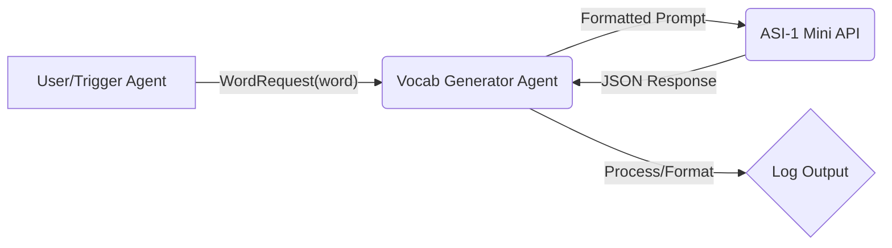

# ✨ Vocab Agent: AI-Powered Content Automation for Language Creators ✨


[](https://www.python.org/)
[](https://opensource.org/licenses/MIT)
[](https://agentverse.ai/)
[](https://docs.asi1.ai/)

**Hackathon Project for: Unlocking the Power of Agentverse by Fetch.ai (Dubai 2025)**

---

## 🚀 Project Overview

**Vocab Agent** is an autonomous AI agent built using the **Fetch.ai uAgents library** and hosted within the **Agentverse ecosystem**. It leverages the cutting-edge **ASI-1 Mini Large Language Model** to automate the creation of rich, engaging vocabulary learning content specifically designed for social media platforms.

Given a single English word, Vocab Agent autonomously researches, generates, and formats a complete content package including translations, definitions, examples, and more, delivered in a structured JSON format with a ready-to-post description. This project aims to drastically reduce content creation time for language educators and creators, enabling them to focus on community engagement.

---

## 🎯 The Problem

Language content creators, educators, and influencers face significant challenges:

*   **Time Sink:** Manually researching vocabulary (definitions, phonetics, translations, synonyms, antonyms, example sentences) for daily posts is incredibly time-consuming.
*   **Consistency:** Maintaining a consistent format, tone, and quality across numerous posts is difficult.
*   **Engagement:** Crafting posts that are not just informative but also engaging requires extra effort (e.g., adding relevant questions).
*   **Multilingual Complexity:** Providing accurate translations and context requires linguistic expertise or tedious lookups.

---

## 💡 Our Solution: Vocab Agent

Vocab Agent acts as an autonomous content assistant. It streamlines the entire vocabulary post-creation process:

1.  **Input:** Receives a single English word via an agent message (`WordRequest`).
2.  **AI-Powered Generation:** Constructs a detailed prompt and queries the **ASI-1 Mini LLM** via its API.
3.  **Rich Data Extraction:** Instructs ASI-1 Mini to return a structured JSON object containing:
    *   The original word
    *   Arabic translation
    *   Phonetic transcription
    *   Clear English meaning
    *   Comma-separated synonyms
    *   Comma-separated antonyms
    *   An example sentence (with the word highlighted)
    *   Arabic translation of the example sentence
    *   A relevant Merriam-Webster URL
    *   An engaging question related to the word
    *(Note: SVG icon generation was initially requested but deferred due to current LLM limitations)*
4.  **Automated Formatting:** Parses the JSON response and automatically generates a ready-to-use social media post description, incorporating key elements like the word, the generated question, and relevant hashtags.
5.  **Output:** Logs the complete generated JSON data, including the formatted description, ready for the creator to use or for future integration with posting mechanisms.

---

## ✨ Key Features

*   **Autonomous Content Generation:** Operates independently upon receiving a word request.
*   **Powered by ASI-1 Mini:** Leverages Fetch.ai's advanced agentic LLM for complex data generation.
*   **Multi-lingual:** Provides both English details and Arabic translations.
*   **Rich Vocabulary Data:** Generates multiple facets of vocabulary information from a single input.
*   **Structured JSON Output:** Delivers predictable, machine-readable data.
*   **Ready-to-Use Post Formatting:** Includes a pre-formatted description suitable for social media.
*   **Built on Agentverse:** Utilizes the robust and scalable `uagents` framework.

---

## 🛠️ Technical Architecture

The system employs a simple yet powerful agent-based architecture:



## 💻 Technology Stack

*   **Core Framework:** Fetch.ai Agentverse (`uagents` library)
*   **AI Model:** Fetch.ai ASI-1 Mini (via REST API)
*   **Language:** Python 3.8+
*   **API Interaction:** `requests` library
*   **Data Handling:** `json`, `re`

---

## 🎬 Demo

**(Link to your 5-minute demo video will go here)**

**What to look for in the demo:**

1.  Starting the `vocab_generator_agent.py`.
2.  Running the `trigger.py` script to send a word request (e.g., "browser").
3.  The `vocab_generator_agent` terminal showing:
    *   Receipt of the `WordRequest`.
    *   The call being made to ASI-1 Mini.
    *   Successful parsing of the JSON response.
    *   The **full logged JSON output** containing all generated fields.
    *   The **formatted post description** logged separately.

**Example Output Log Snippet:**

```log
INFO:     [vocab_generator]: Successfully generated vocabulary data for word 'browser':
INFO:     [vocab_generator]: Full Generated Data: {
  "word": "browser",
  "word_arabic": "متصفح",
  "phonetic": "/ˈbraʊzər/",
  "meaning": "a computer program that is used to find and look at information on the Internet",
  "synonyms": "navigator, web client, net browser",
  "antonyms": "server, host, mainframe",
  "example_sentence": "I opened my web _browser_ to search for information.",
  "example_sentence_arabic": "فتحت متصفح الويب الخاص بي للبحث عن المعلومات.",
  "url": "https://www.merriam-webster.com/dictionary/browser",
  "question": "What's your favorite web browser and why?",
  "description": "#DailyLex Word of the Day: browser\n\n🗣 Your Turn!\nWhat's your favorite web browser and why?\nShare it below!\n\n🔗 Read More (https://www.merriam-webster.com/dictionary/browser)\n📌 #DailyBrowser | @dailylex_en"
}
```

---

## 🚀 Getting Started

Follow these steps to set up and run the Vocab Agent locally.

**Prerequisites:**

*   Python 3.8 or higher
*   `pip` package installer
*   `git` version control

**Setup:**

1.  **Clone the Repository:**
    ```bash
    git clone https://github.com/WaleedAlrashed/innovationlab-hackathon
    cd innovationlab-hackathon
    ```

2.  **Create and Activate Virtual Environment:**
    ```bash
    python -m venv .venv
    # Windows
    .\.venv\Scripts\activate
    # macOS/Linux
    source .venv/bin/activate
    ```

3.  **Install Dependencies:**
    ```bash
    pip install -r requirements.txt
    ```

4.  **Configure ASI-1 API Key:**
    *   Obtain your API key from the [ASI-1 Platform](https://asi1.ai/).
    *   **Option A (Recommended):** Set it as an environment variable:
        ```bash
        # macOS/Linux
        export ASI_API_KEY="YOUR_ASI1_API_KEY_HERE"
        # Windows (Command Prompt)
        set ASI_API_KEY="YOUR_ASI1_API_KEY_HERE"
        # Windows (PowerShell)
        $env:ASI_API_KEY="YOUR_ASI1_API_KEY_HERE"
        ```
    *   **Option B:** Directly edit the placeholder in `vocab_generator_agent.py`:
        ```python
        ASI_API_KEY = os.environ.get("ASI_API_KEY", "YOUR_ASI1_API_KEY_HERE") # Replace placeholder
        ```

5.  **Configure Agent Address:**
    *   Run the generator agent once to get its address:
        ```bash
        python vocab_generator_agent.py
        ```
    *   Copy the address printed (e.g., `agent1q...`).
    *   Open `trigger.py` and paste the copied address into the `VOCAB_AGENT_ADDRESS` placeholder variable.

---

## ▶️ Usage

1.  **Start the Vocab Generator Agent:**
    Open a terminal, activate the virtual environment, and run:
    ```bash
    python vocab_generator_agent.py
    ```
    Keep this terminal running.

2.  **Trigger Content Generation:**
    Open a *second* terminal, activate the virtual environment, and run:
    ```bash
    python trigger.py
    ```
    *(This will send a request for the word "browser" by default. You can edit the `target_word` in `trigger.py`)*

3.  **View Output:**
    Observe the terminal where `vocab_generator_agent.py` is running. You will see logs indicating the request being received, the call to ASI-1, and finally, the **full generated JSON data** and the **formatted description** printed to the console upon successful completion.

---

## 🏆 Hackathon Submission Details

*   **Track:** Creator Economy
    *   *Justification:* This agent directly empowers digital creators (language educators/influencers) by automating a core part of their content creation workflow, saving significant time and effort.
*   **ASI-1 Mini Challenge:** Met
    *   *ASI-1 Mini Integration:* The agent relies entirely on the ASI-1 Mini API for its core generation capabilities.
    *   *Agentic Reasoning & Multi-Step Task Execution:* The agent formulates a complex prompt requiring ASI-1 Mini to perform multiple sub-tasks based on a single input word and return a structured output.
    *   *ChatProtocol v0.3.0:* Assumed to be utilized by the official ASI-1 API endpoint.
*   **TransactAI Award:** Not implemented in the current version.

---

## 🔮 Future Enhancements

*   **Direct Social Media Posting:** Integrate with APIs (e.g., Telegram Bot API, Twitter API) to post the generated content directly.
*   **Web UI:** Develop a more interactive UI (e.g., using Streamlit or Flask) for easier word input and viewing results.
*   **Batch Processing:** Allow users to input a list of words for batch generation.
*   **Customizable Templates:** Enable users to customize the output format/description template.
*   **SVG Icon Generation:** Revisit icon generation, potentially using a different model or technique if ASI-1 Mini struggles consistently.
*   **More Languages:** Extend support for different input/output languages.
*   **Agentverse Deployment:** Deploy the agent permanently on the Agentverse platform for continuous availability.

---

## 👥 Team

*   **(Your Name/Team Name)**
*   *(Briefly mention roles if applicable)*

---

## 📄 License

This project is licensed under the MIT License - see the [LICENSE](LICENSE) file for details.
